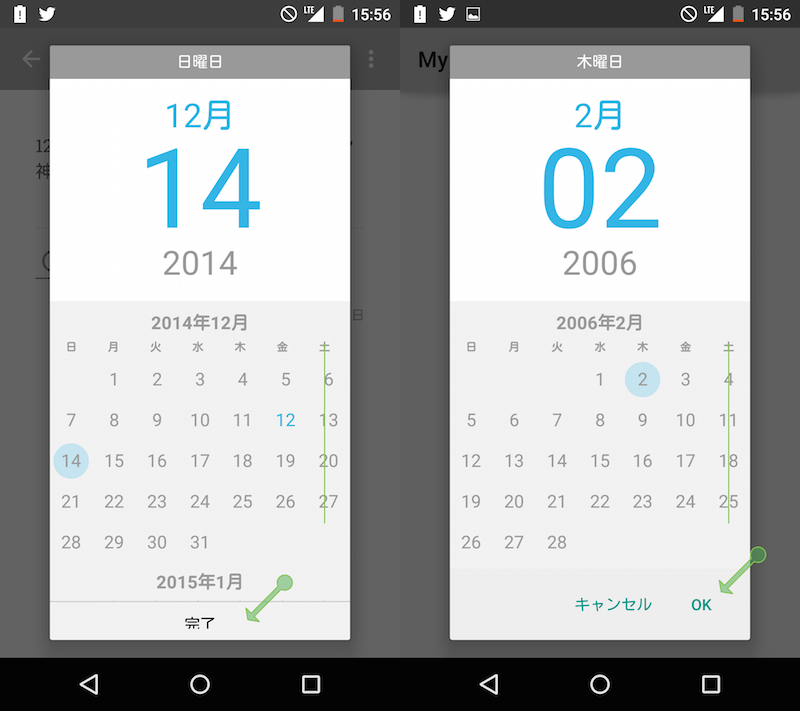

DateTimePicker
====================

Date and Time Picker Dialog Library for Android 4.0+

Original is The Android Open Source Project
- https://android.googlesource.com/platform/frameworks/opt/datetimepicker/

This project is fork of above project and following changes:

- Week string is out of alignment of Day string (See image below)
- [TimePickerDialog] When Press Back button if showing TimePickerDialog, calling onCancel() not onDismiss()
 - Implement of calling onDismiss() is default of platform/frameworks/opt/datetimepicker
- Use dialog button, not custom view (See image below)
- Gradle Integration.

Left : before(original of platform/frameworks/opt/datetimepicker) / Right : after(this project)

How to use
--------------------

WIP... Sorry ;-)

Licenses
--------------------

    Copyright (C) 2013 The Android Open Source Project
    Copyright (C) 2014 Seesaa Inc.

    Licensed under the Apache License, Version 2.0 (the "License");
    you may not use this file except in compliance with the License.
    You may obtain a copy of the License at

       http://www.apache.org/licenses/LICENSE-2.0

    Unless required by applicable law or agreed to in writing, software
    distributed under the License is distributed on an "AS IS" BASIS,
    WITHOUT WARRANTIES OR CONDITIONS OF ANY KIND, either express or implied.
    See the License for the specific language governing permissions and
    limitations under the License.